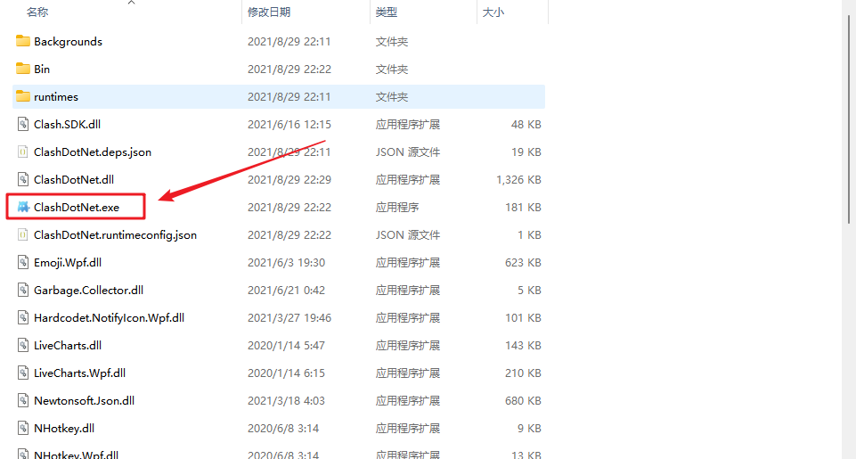
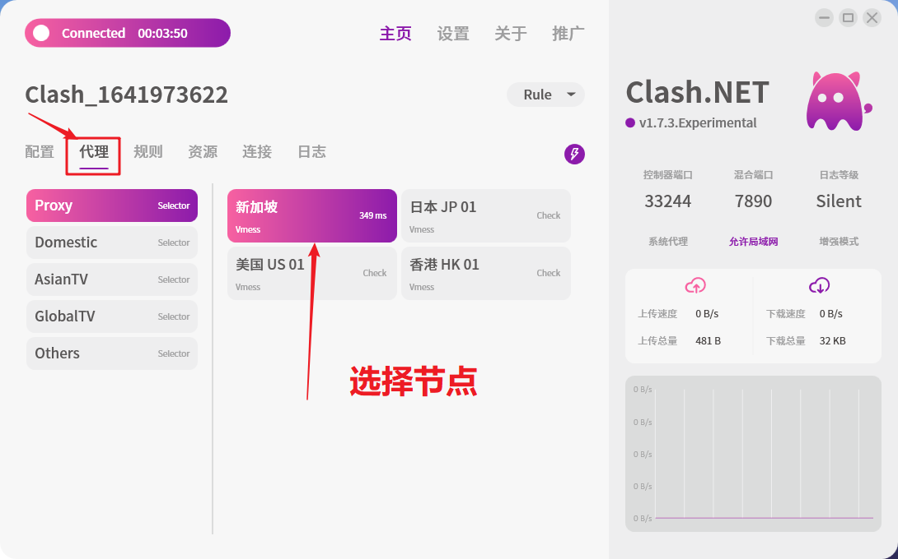
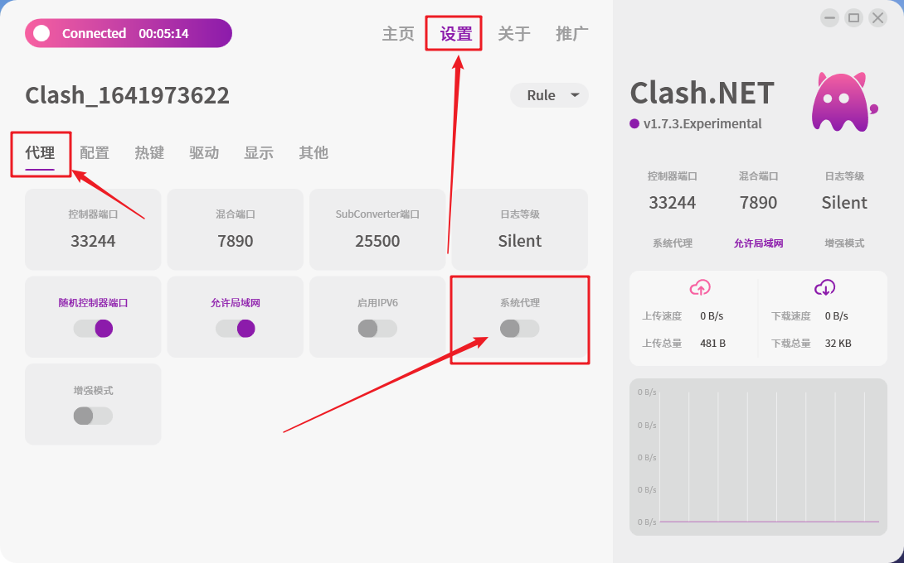

# ClashDotNet教程（推荐使用）

这里是Windwos电脑客户端教程。！！！请每隔两三天更新配置，自动获得最新节点和删除失效节点！！！

## 一、安装.NET 5.0 

#### .NET 5.0下载地址：[https://dotnet.microsoft.com/download/dotnet/5.0/runtime](https://dotnet.microsoft.com/download/dotnet/5.0/runtime)

下载完成后直接安装

## 二、下载软件，并解压软件到你的电脑 

[直链下载](https://file.tiyunzong.cloud/Downloads/Clash\_NET\_1.2.8.7z)

## 二、打开软件 

打开软件

软件主界面

右下角任务栏小图标

## 三、导入配置文件 

打开主页地址，选择一键导入Clash配置

.PNG>)

单击一键导入Clash

然后单击打开

软件会自动下载配置文件

## 四、开启代理 

选择你想要使用的节点

开启系统代理

任务栏的图标变色了，说明开启成功

开启系统代理1-2秒后，就可以正常的打开Google啦。

## 五、更新订阅 

请经常更新配置文件，自动获得最新节点和删除失效节点。重要!!!!!!!!!!!!!

.png>)
